# Crowd Aids

## Introduction

## Functional description

This application offers the possibility to search by an API external (Surfline), a beach on the world who has entering on the data base, to see the extended swell forectas to know when is the best time to go surfing.

### Use cases

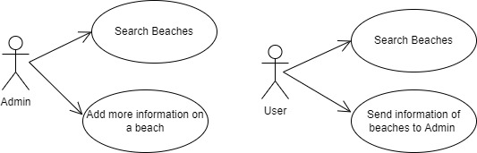

### Activities

#### Register and Login

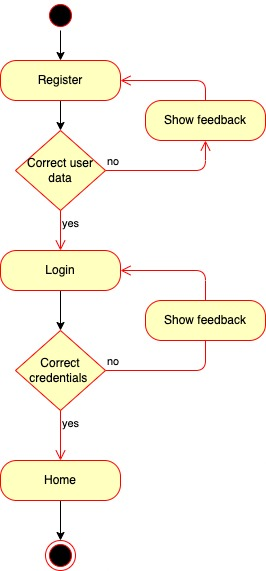

#### Modify User

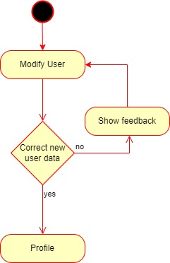

#### Delete User

#### Search Beach

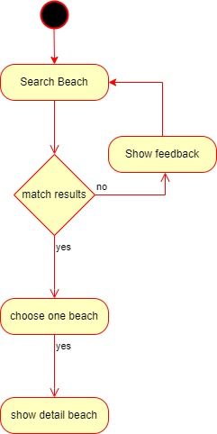

#### Toggle Favorites

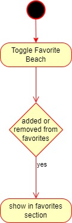

## Techinal description

### Block

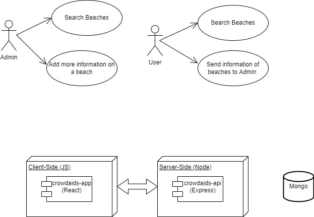

### Sequences

#### Register user

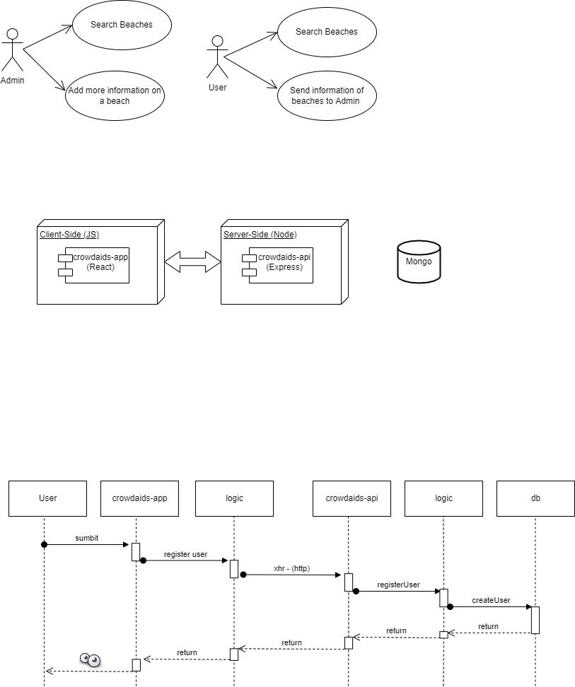

#### Authorization user

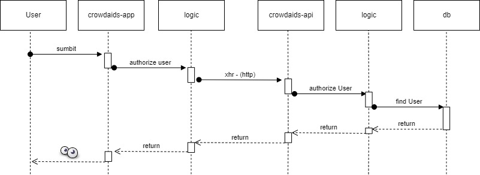

#### Retrieve user

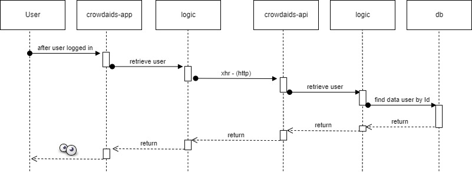

#### Modify user

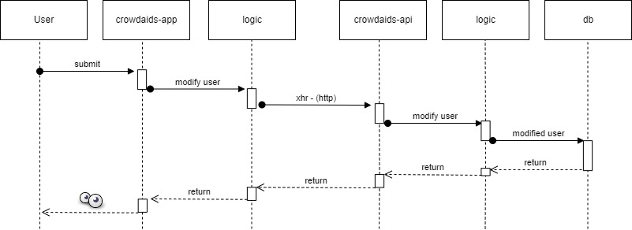

#### Unregister user

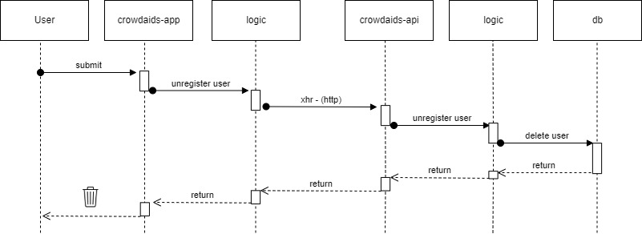

#### Search beach

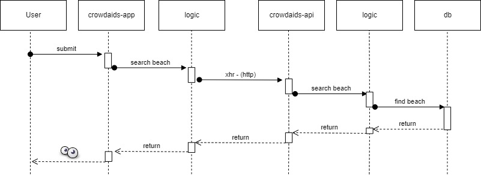

#### Retrieve beach

#### Toggle favorite beach

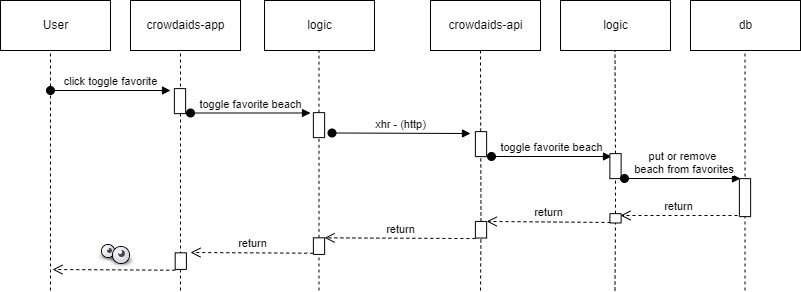

#### Retrieve favorite beach

#### Send info to admin

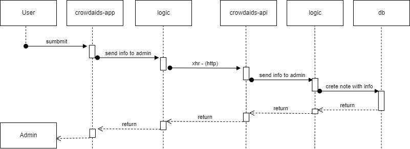

### Data model

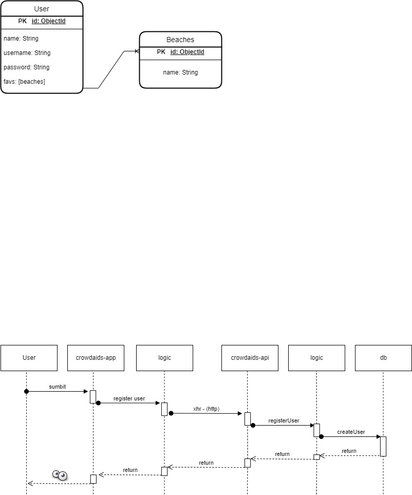

### Code coverage

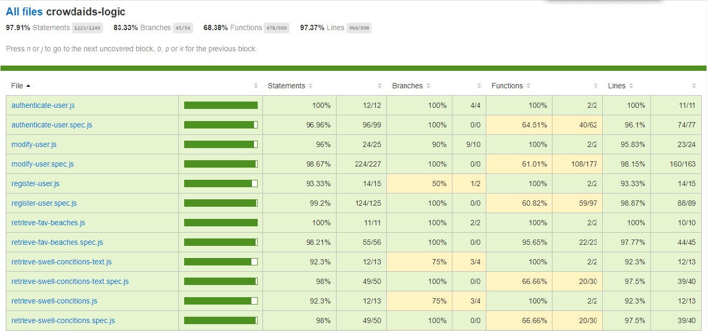
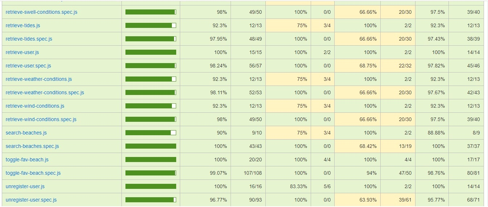

### Techonoliges

<table>
    <row>
        <td>
            
        </td>
        <td>
            
        </td>
        <td>
            
        </td>
        <td>
            
        <td>
        <td>
            
        </td>
        <td>
            
        </td>
    </row>
</table>

### TODO

<ul>
    <li>
        
Send information like text or image to the admin

    </li>
    <li>
        
Create data model beach when the admin receive information from users

    </li>
    <li>
        
Add the information beach received by the user, that can be used on a searched beach

    </li>
</ul>

