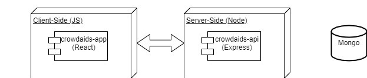
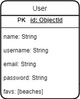

# Crowd Aids

## Introduction

## Functional description

This application offers the possibility to search a beach on the world who has entering on de data base, to see the extended swell forectas to know when is the best time to go surfing. Also, provide information about wich type of wetsuits are best to wear based on the current weather.

### Use cases

### Activities

#### Register and Login

## Techinal description

### Block

### Sequences

#### Register user

### Data model

### Code coverage

![code coverage]

### Techonoliges

<table>
    <row>
        <td>
            
        </td>
        <td>
            
        <td>
    </row>
</table>