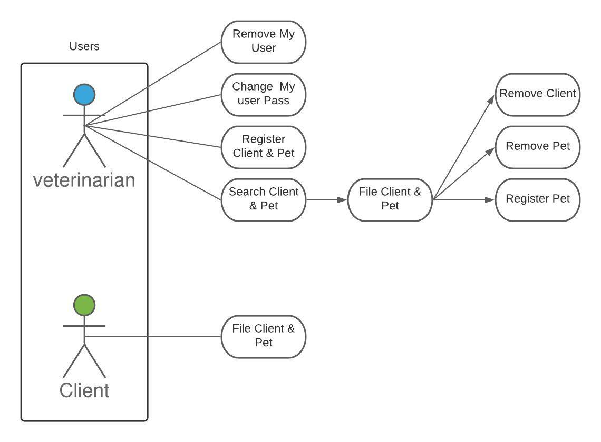
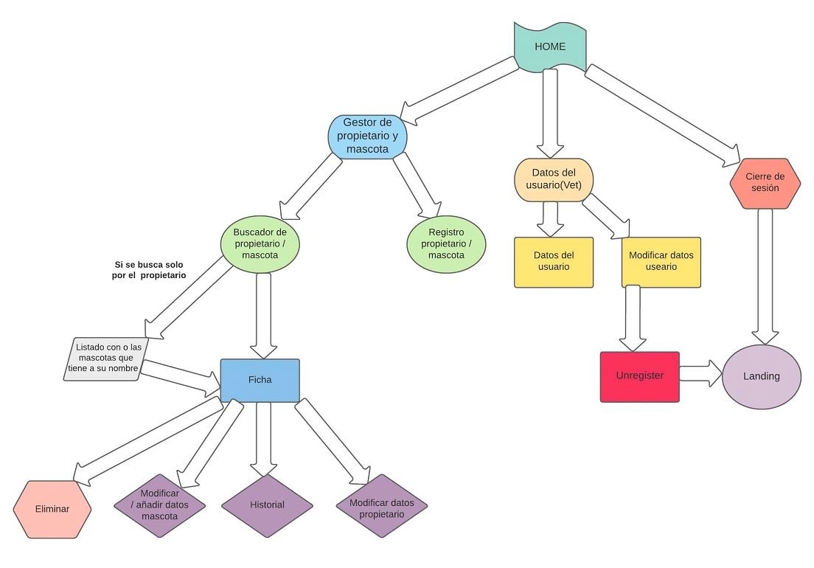
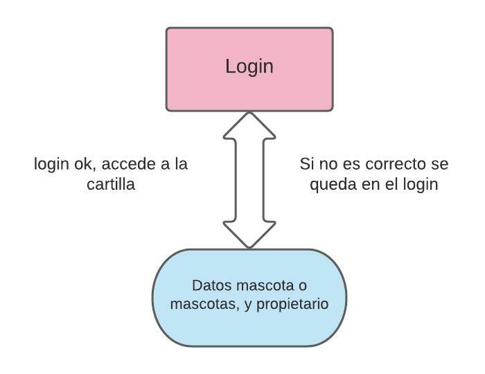
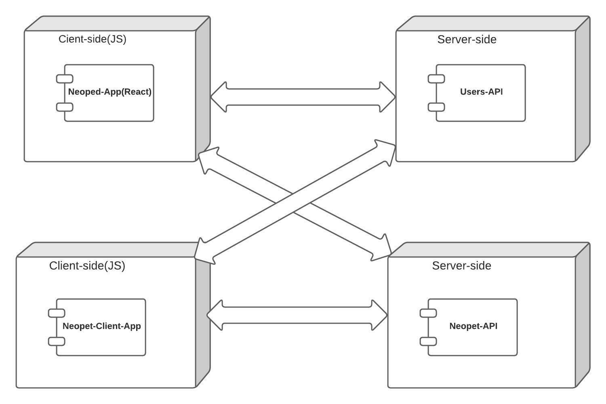
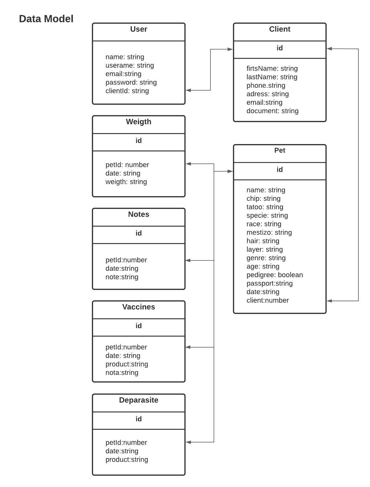

# NeoPet

## Introduction

Se trata de una una aplicación destinada para clinicas veterinarias y sus clientes. La idea principal es que el cliente pueda tener una cartilla digital en la que aparezcan sus datos y los de la mascota con sus vacunas, desparasitaciones y/o tratamientos. Para ello la aplicación tiene dos partes, una para el veterinario y otra para el cliente. La funcionalidad de la primera es la de crear fichas de la mascota y que el veternirario puede gestionarlas y actualizarlas. Y la segunda parte tiene la funcionalidad de una cartilla, es decir, el propietario solo puede ver los datos actualizados de su mascota y asi siempre ternerlo a mano. 

## Functional description

### Funcionalidad del Registro

Permite registrar al usuario en NeoPet.

 Este registro consta de dos tipos de usuario:

Veterinario

⦁	Nombre 

⦁	Email

⦁	Nombre de usuario

⦁	Contraseña

Propietario

(el propietario queda registrado por el veterinario, utilizará su email como username y el dni como password)

Cuando los usuarios están registrados pueden acceder al Login.
Funcionalidad del Login
Permite que el usuario inicie sesión. En este caso se necesitará:

Veterinario y Propietario

⦁	Nombre de usuario

⦁	Contraseña

Una vez que los usuarios se logueen pueden acceder a la Home Page.

### Funcionalidad de NeoPet en clínica

El usuario una vez logueado accederá a su Home Page, esta estará compuesta por:
1.	Datos del usuario(veterinario): Ver sus datos o modificar datos(dónde se puede desregistrar)

2.	Cierre de sesión
3.	Buscador que tenga la funcionalidad de buscar por datos del propietario o de la mascota.
⦁	Si busca por el nombre del propietario se abrirá un listado en el que aparecen la o las mascotas que tiene a su nombre
⦁	Si busca por el nombre de la mascota se abrirá la ficha de este

       Nota: Normalmente se busca por nombre de la mascota de la mascota

 4. Ficha:	

⦁	Apareceran los datos de la mascota

⦁	Se podrán actualizar los datos tanto de la mascota como del propietario
⦁	Se accederá al historial de la mascota.

⦁	Eliminar ficha

 5. Registro Propietario y mascota

  ### Funcionalidad de NeoPet para el cliente

El usuario una vez logueado accederá a su Home Page, esta estará compuesta por:

1.	Propietario: el propietario prodrá ver sus datos y los de su mascota

⦁	Vacunas

⦁	Datos de la mascota (Aquí se podrán comprobar los datos de la mascota,nombre,raza,edad,etc.)

⦁	Desparasitaciones

     2. Cierre de sesión: botón de cierre de sesión => Landing

### Use cases

### Activities

#### Register and Login

#### 

#### Neopet Veterinariry

#### Neopet Owner

## Technical description

### Blocks

### Sequences

#### Register user

### Data model

### Technologies

React

Css

JSON.Server

<table>
    <row>
        <td>
            
        </td>
        <td>
            
        <td>
    </row>
</table>