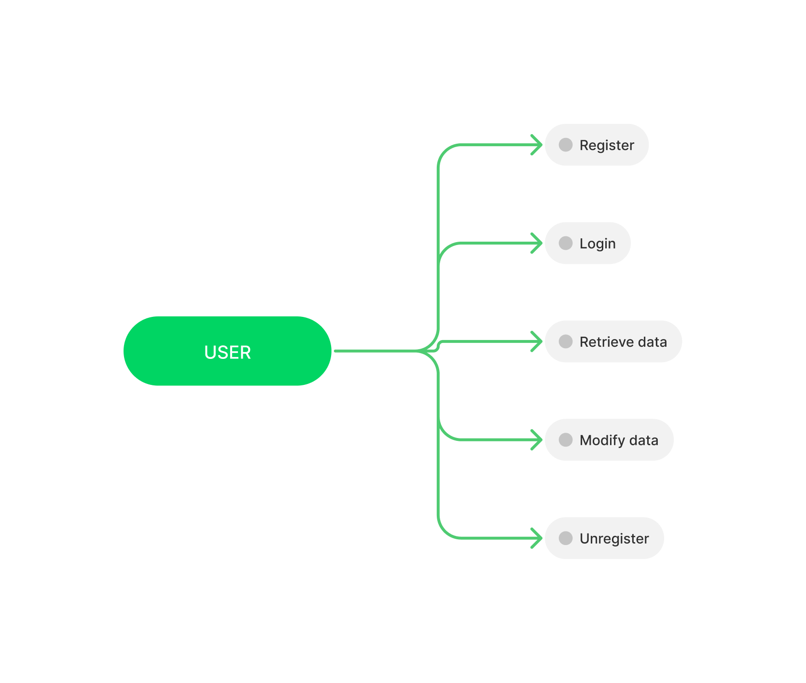
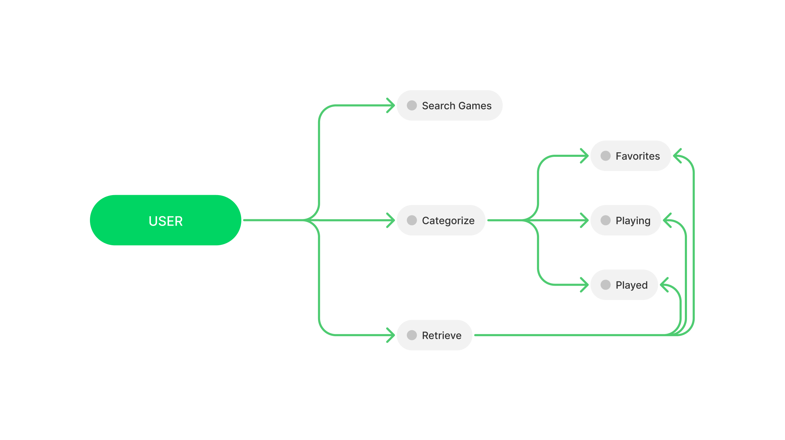
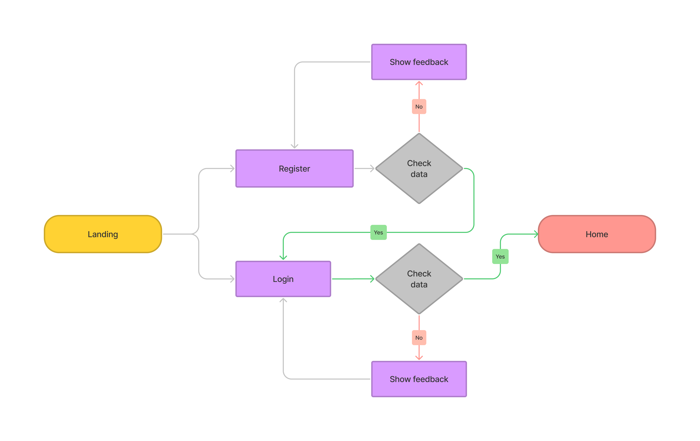
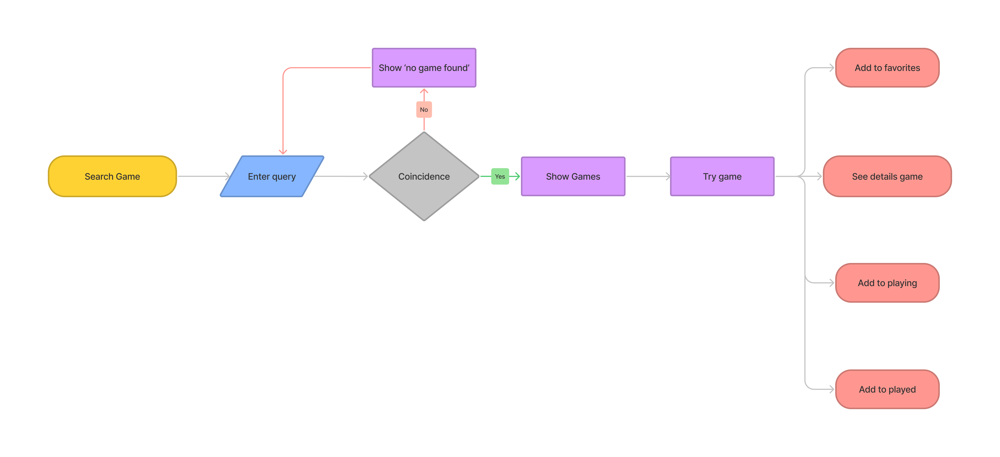
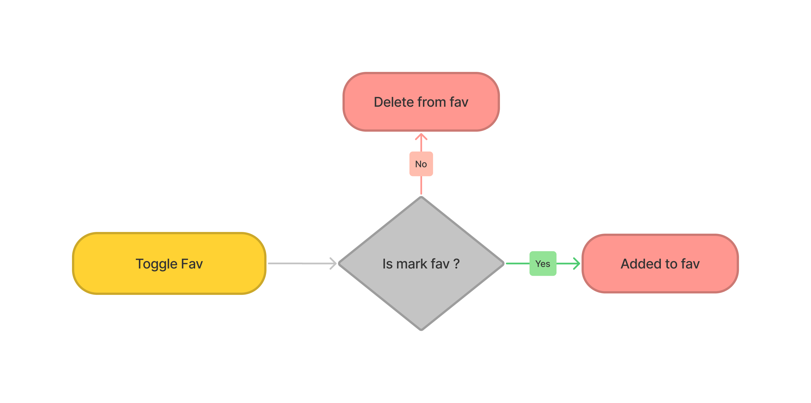
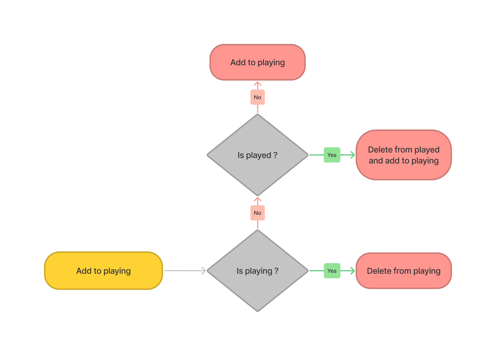
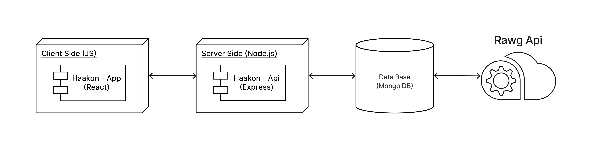
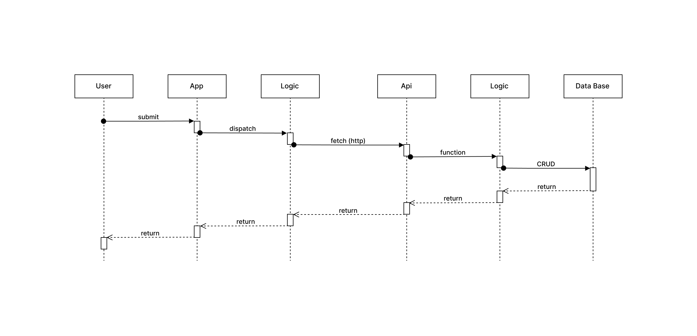
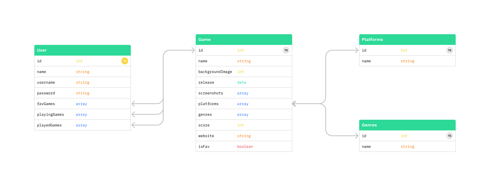
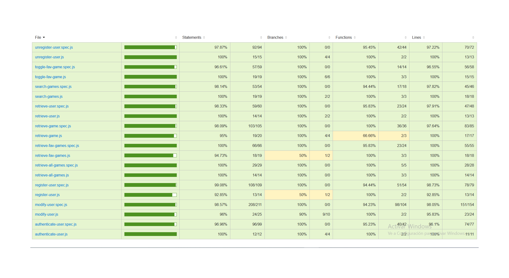

# Haakon

## Descripción

Haakon es una aplicación donde podrás navegar, buscar y explorar en una base de datos de más de 50.000 videojuegos.

### **Organiza tu collección**

Marca los juegos que deseas, los que estás jugando, lo que has finalizado. <!--escribe tus opiniones y valora-->

## Casos de uso

<!-- Other name? -->

## User Flow

### Login to Home

### Home to ...

## Functions Flow

### Toggle Fav

### Add to playing

## Technical Description

### Blocks

### Sequences

### Data Models

### Code Coverage

## Technologies

## To-Do ✔

-   [ ] Add platforms and genres
-   [ ] Review a game
-   [ ] Add more categories
-   [ ] Deploy
-   [ ] Test in recat

<!--
   Markdown reference
    - Images
        
    - Link Images
        
 -->
