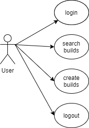
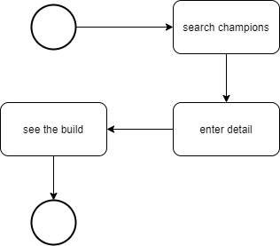
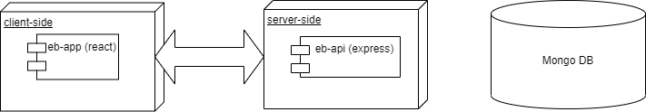
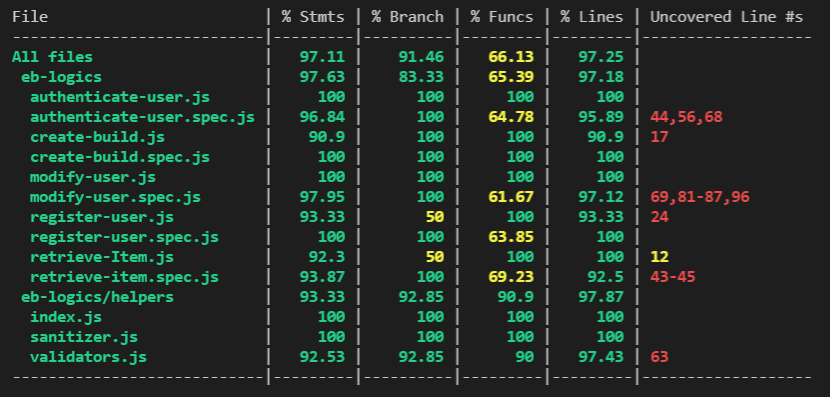

# EZ BUILDS

## App description

This is an app made to new league of legends players who want to know which objects they should buy with any champion or save and share their own builds. The user have acces to all the builds created by all the users registered in the web app. 

### Use cases

### User flow

### Blocks

### Data models

### Code coverage

 

### Techonoliges

- JavaScript
- React
- NodeJS
- Express
- Mongo
- Mongoose
- Mocha/Chai

### TODO 

- Testing of every function
- Improve styles 