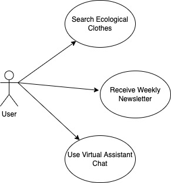
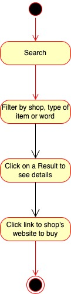
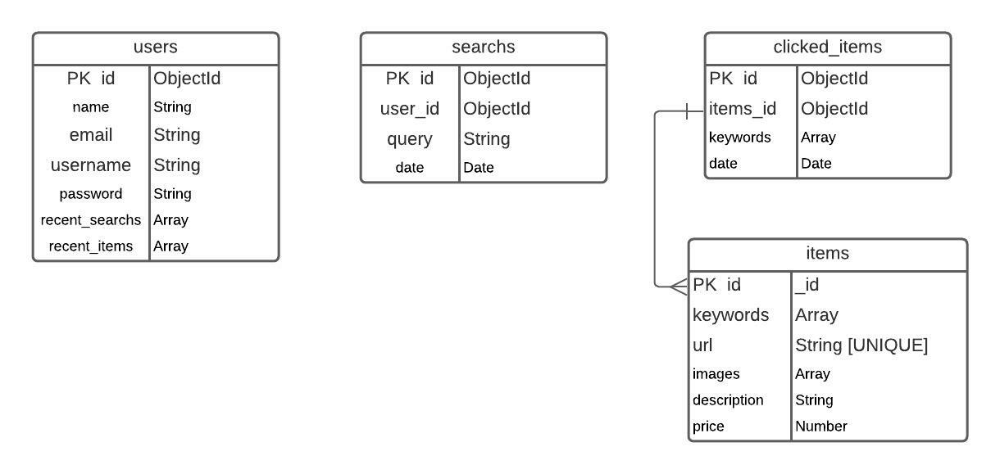

# Logical Echo

## Introduction

Logical Echo selects for you among the big brands the items labelled as "ecological" or "sustainable".

/cdn.vox-cdn.com/uploads/chorus_asset/file/10380345/Style_Match_3_WW.png)

## Functional description

Logical Echo scrapes clothing stores' websites and downloads the items labelled as "ecological" or "sustainable". 
It has a search feature that allows you to filter by shop, by type of item or by specific word, knowing that all the results you'll receive are sustainable items.
The app offers the possibility to create an account and also the option to receive a weekly newsletter with the new items found with the label "ecological" or "sustainable".
Finally there is a virtual assistant chat feature.

### Use cases

### Activities

#### Search items

## Technical description

### Blocks

### Sequences

#### Search Sequence

### Data model

### Code coverage

### Technologies

<table>
    <row>
        <td>
            
        </td>
        <td>
            
        <td>
        <td>
            
        </td>
        <td>
            
        </td>
        <td>
            
        </td>
    </row>
</table>

### TO DO ("Mea culpa")
- Completar testing
- Arreglar el CSS
- Sección de tendencias
- Completar scraping
- Lógica para preparar y mandar la Newsletter semanal
- Crear asistente virtual
