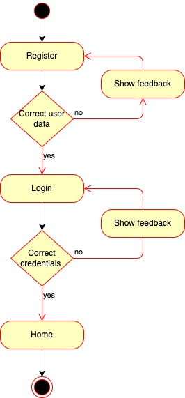

## Introduction

# Nts

Backoffice application to a receptive tourism operator in Argentina, capable of managing reservations for each agency that registers

## Functional description

- Log in & Register 
- Make, modify and delete Reservations, check status and search them.
- Add Notes to reservations
- Change Password
- Delete User
- Sign out

### Use cases

### Activities

#### Register and Login

#### Modify user

#### Delete user

#### Search 

#### Reservation

## Technical description

### Blocks

### Sequences

#### Register user && all cases 

### Data model

### Technologies

- JavaScript
- React
- Css
- React Bootstrap
- NodeJS
- Express
- Mongo
- Mongoose

## TO DO ("MEA CULPA")

- Testing
- Css 
- Validators
- Fix dates
- DB with prices and hotel list