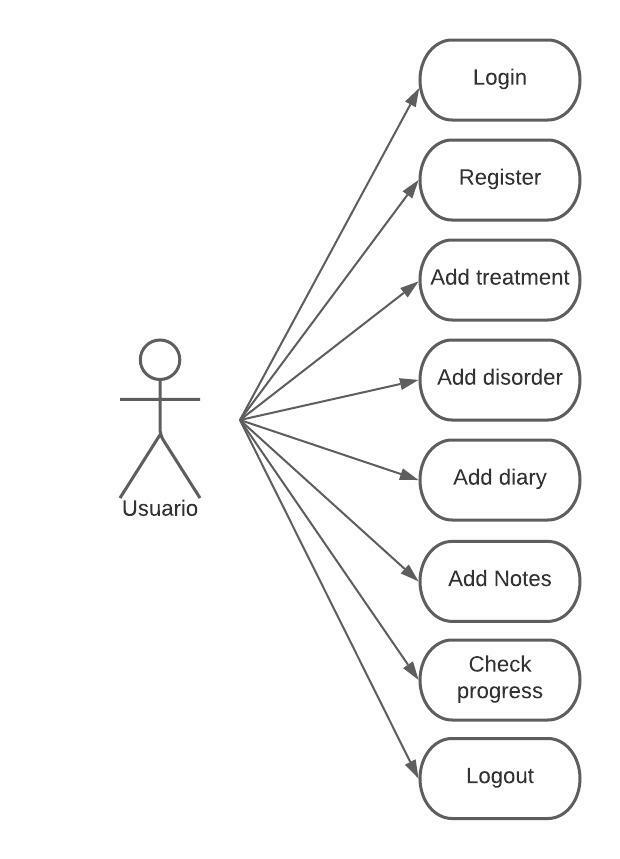
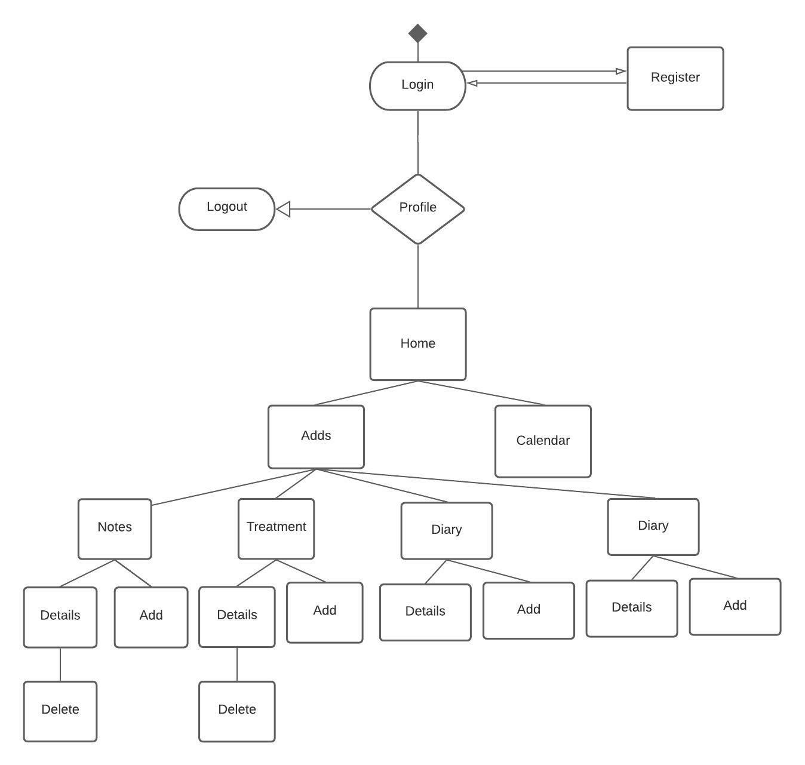
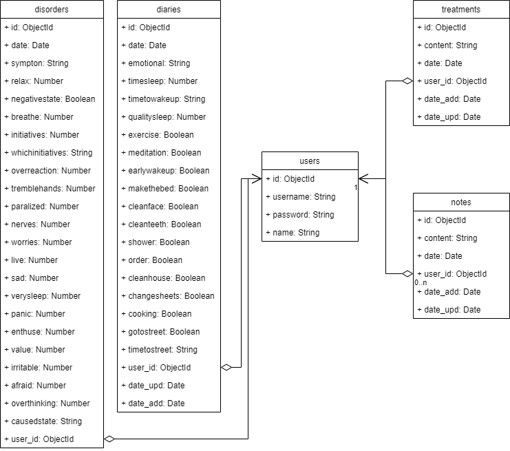
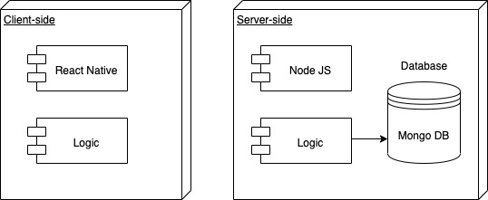

# 🧠😊In My Mind😊🧠

In My Mind es una app web que consiste en un control diario del estado emocional de personas con ansiedad, depresión, estres ...
El usuario tiene acceso a su calendario donde podra consulta su diario que consiste en rutinas, el tratamiento que esta siguiendo actualmente, sus alteraciones mentales donde consulta como fue la alteración que tuvo en el dia en concreto que marque y por ultimo las notas que quiera registar de libre elección.

Para ello tendra el usuario que registar todos esos apartados en botones para acceder a esas funcionalidades, en el que encontrara formularios y zonas de texto.

# 📅Functional description📅

- Usuario se puede registrar y iniciar su sessión
- Podra añadir su estado emocional diariamente
- Añadir el tratamiento actual
- Añadir cada vez que ha tenido un ataque de ansiedad y describirla 
- Añadir Notas que puede utilizar para remarcar algo o como recordatorio
- Podra acceder a la información registrada por cada dia en el calendario
- Realizar cambio de contraseña
- Eliminar su usuario
- Salir de su usuario

# 🧘Use-Case🧘

# 📋Technical Description📋

# Flow Chart

# Data Model

# Blocks
